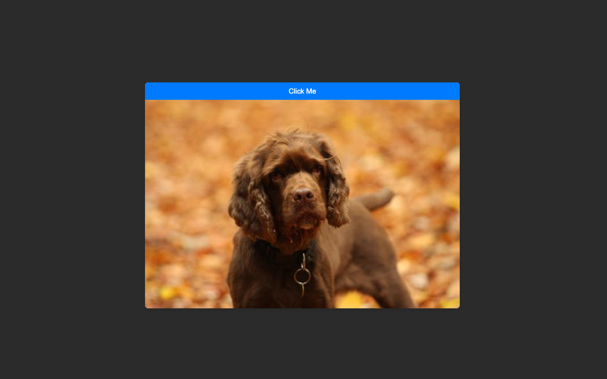

# Get A Dog

> A simple website allows the user to get a dog.

## Table of contents

- [General info](#general-info)
- [Screenshots](#screenshots)
- [Technologies](#technologies)
- [Setup](#setup)
- [Features](#features)
- [Status](#status)
- [Inspiration](#inspiration)
- [Contact](#contact)

## General info

> The objective of the project is to practice using get requests and apply separation of concerns.

## Screenshots



## Technologies

- JavaScript
- HTML5
- CSS3
- VSC code

## Setup

- clone the repo.
- `npm install`

## Code Examples

```js
const getDog = async () => {
  const url = 'https://dog.ceo/api/breeds/image/random';
  try {
    const res = await fetch(url);
    if (!res.ok) {
      throw new Error(`Failed to fetch a dog with status : ${res.status}`);
    }
    const data = await res.json();
    return data;
  } catch (err) {
    console.error(err);
  }
};

export default getDog;
```

## Features

List of features ready and Todos for future development

-
-
-

To-do list:

-
-

## Status

Project is: _in progress_
